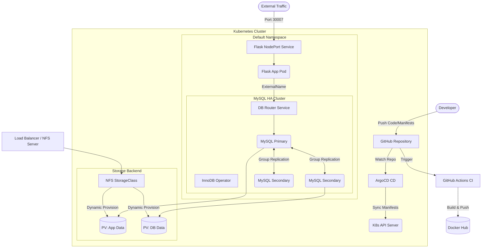

# Highly Available GitOps Kubernetes Architecture

## 📖 Project Overview
This project demonstrates a production-grade, fully automated GitOps workflow. It features a continuous integration (CI) pipeline that builds and pushes containerized applications, and a continuous deployment (CD) pipeline that synchronizes cluster state using ArgoCD. 

The core infrastructure hosts a Python Flask application connected to a highly available MySQL database cluster, utilizing dynamic NFS storage provisioning and native Kubernetes operators to ensure zero-downtime failovers and persistent data integrity.

## 🏗️ High-Level Architecture Diagram



## 🛠️ Architectural Decisions & Best Practices

### 1. MySQL InnoDB Operator vs. StatefulSets
Managing databases in Kubernetes is notoriously difficult. While Kubernetes provides `StatefulSets` for stateful workloads, a standard StatefulSet is "database blind." 

**The Problem with StatefulSets:**
If we used a standard StatefulSet for MySQL, it would ensure the pods have persistent network IDs and storage, but it would **not** know how to configure MySQL replication, handle primary elections, or recover from a "split-brain" scenario if the network partitions. We would have to write complex init-containers and custom bash scripts to handle failovers.

**The Operator Solution:**
We utilized the **MySQL InnoDB Operator**. An Operator extends the Kubernetes API with custom, application-specific knowledge. 
*   It automatically configures **MySQL Group Replication** across our 3 instances.
*   If the primary database node goes down, the Operator detects it and safely promotes a secondary node to primary without human intervention.
*   It automatically provisions an internal router service, ensuring our Flask app never sends write requests to a read-only replica.

### 2. Dynamic vs. Static NFS Provisioning
To ensure data survives pod restarts and node failures, we attached the cluster to an external NFS server (hosted on the Load Balancer node).

**Static Provisioning (The Old Way):**
An administrator must manually create `PersistentVolume` (PV) objects of specific sizes ahead of time. When an app needs storage, it tries to find a PV that matches its request. This does not scale and creates administrative overhead.

**Dynamic Provisioning (Our Approach):**
By installing the `nfs-subdir-external-provisioner` and defining a default `StorageClass`, we enabled dynamic provisioning. When the MySQL Operator requests 5Gi of storage via a `PersistentVolumeClaim` (PVC), the StorageClass automatically talks to the NFS server, creates the exact directory needed, and binds the volume on-the-fly. This represents a modern, hands-off infrastructure-as-code pattern.

***

You should add this **Project Execution Map** right at the end of the **Project Overview & Architecture** section, just before you start `## Phase 1: Continuous Integration (CI)`. 

This gives the reader a clear, chronological roadmap of the project before they dive into the technical commands.

Here is the markdown snippet you can copy and paste directly into that spot:

***

## 🗺️ Project Execution Map

This project was built and deployed in five distinct phases:

1.  **Phase 1: Continuous Integration (CI)**
    *   Built the Docker images for the Flask app and MySQL custom image using GitHub Actions and pushed them to Docker Hub.
2.  **Phase 2: Cluster Prerequisites & Storage**
    *   Verified cluster health and configured dynamic NFS storage provisioning via Helm.
3.  **Phase 3: Application Deployment**
    *   Deployed the Flask application, configured its environment variables via ConfigMaps, and exposed it using a NodePort Service.
4.  **Phase 4: Database Setup (Stateful Workload)**
    *   Deployed a 3-node Highly Available MySQL cluster using the InnoDB Operator and configured an ExternalName Service for seamless application routing.
5.  **Phase 5: Continuous Deployment (CD)**
    *   Installed ArgoCD and configured an Application manifest to establish a GitOps sync loop with this repository.

*** 


## Phase 1: Continuous Integration (CI)

Our Continuous Integration pipeline is handled via GitHub Actions. The workflow is designed to build the application and database images and push them to Docker Hub.

### Workflow Details
*   **Trigger:** Manual execution via `workflow_dispatch`.
*   **Jobs:** Two parallel jobs (`build-flask-app-package` and `build-mysql`) to speed up the execution time.
*   **Tagging Strategy:** Each image receives two tags:
    1.  `latest`: Simplifies the Kubernetes deployment manifests by providing a fixed tag to pull the most recent build.
    2.  `YYYY-MM-DD-<run-id>`: A unique, traceable tag used for version control and potential rollbacks.

### GitHub Actions Workflow (`ci.yml`)

```yaml
name: Build Docker Image Workflow

on:
  workflow_dispatch:

env:
  FLASKAPP_IMAGE_NAME: flask-app
  MYSQL_IMAGE_NAME: mysql

jobs:
  build-flask-app-package:
    runs-on: ubuntu-latest
    permissions:
      contents: read
      packages: write

    steps:
      - name: Check out repository
        uses: actions/checkout@v4

      - name: Set image tag
        id: image-tag
        run: |
          TODAY="$(date -u +%Y-%m-%d)"
          IMAGE_TAG="${TODAY}-${GITHUB_RUN_ID}"
          echo "image_tag=$IMAGE_TAG" >> "$GITHUB_OUTPUT"

      - name: Log in to Docker Hub
        uses: docker/login-action@v3
        with:
          registry: docker.io
          username: ${{ secrets.DOCKERHUB_USERNAME }}
          password: ${{ secrets.DOCKERHUB_TOKEN }}

      - name: Build and push flask-app Docker image
        uses: docker/build-push-action@v5
        with:
          context: src/flaskapp
          push: true
          tags: |
            ${{ secrets.DOCKERHUB_USERNAME }}/${{ env.FLASKAPP_IMAGE_NAME }}:latest
            ${{ secrets.DOCKERHUB_USERNAME }}/${{ env.FLASKAPP_IMAGE_NAME }}:${{ steps.image-tag.outputs.image_tag }}

  build-mysql:
    runs-on: ubuntu-latest
    permissions:
      contents: read
      packages: write

    steps:
      - name: Check out repository
        uses: actions/checkout@v4

      - name: Set image tag
        id: image-tag
        run: |
          TODAY="$(date -u +%Y-%m-%d)"
          IMAGE_TAG="${TODAY}-${GITHUB_RUN_ID}"
          echo "image_tag=$IMAGE_TAG" >> "$GITHUB_OUTPUT"

      - name: Log in to Docker Hub
        uses: docker/login-action@v3
        with:
          registry: docker.io
          username: ${{ secrets.DOCKERHUB_USERNAME }}
          password: ${{ secrets.DOCKERHUB_TOKEN }}

      - name: Build and push mysql Docker image
        uses: docker/build-push-action@v5
        with:
          context: src/mysql
          push: true
          tags: |
            ${{ secrets.DOCKERHUB_USERNAME }}/${{ env.MYSQL_IMAGE_NAME }}:latest
            ${{ secrets.DOCKERHUB_USERNAME }}/${{ env.MYSQL_IMAGE_NAME }}:${{ steps.image-tag.outputs.image_tag }}
```

---

## Phase 2: Cluster Prerequisites & Storage

Before deploying stateful workloads, the Kubernetes cluster must be healthy and configured with a dynamic StorageClass backed by our NFS Server (which resides on the Load Balancer node).

### 1. Verify Cluster Health
Ensure all nodes are in a `Ready` state and core Kubernetes components are running.

```bash
# Check node status 
kubectl get nodes

# Verify core components are running
kubectl get pods -n kube-system
```

### 2. Install Helm
Helm is used to package and deploy the NFS provisioner and the database operator.

```bash
curl -fsSL -o get_helm.sh https://raw.githubusercontent.com/helm/helm/main/scripts/get-helm-3
chmod 700 get_helm.sh
./get_helm.sh
helm version
```

### 3. Configure NFS StorageClass
To support dynamic volume provisioning for our stateful workloads, we install the NFS Subdir External Provisioner using Helm.

**Replace the placeholders (`<NFS_SERVER_IP>` and `<NFS_SHARE_PATH>`) with your actual Load Balancer environment details.**

```bash
# Add the Helm repository
helm repo add nfs-subdir-external-provisioner https://kubernetes-sigs.github.io/nfs-subdir-external-provisioner/
helm repo update

# Install the provisioner
helm install nfs-client nfs-subdir-external-provisioner/nfs-subdir-external-provisioner \
    --set nfs.server=<NFS_SERVER_IP> \
    --set nfs.path=<NFS_SHARE_PATH> \
    --set storageClass.name=nfs-storage \
    --set storageClass.defaultClass=true
```

Verify the StorageClass is successfully created and set as the default:

```bash
kubectl get storageclass
```

***


## Phase 3: Application Deployment (Flask App)

The frontend application is a Python Flask API. It connects to the MySQL database and is exposed to external traffic via a `NodePort` service.

### 1. Configure Image Pull Secrets

For security reasons, Docker Hub credentials are not stored in the GitHub repository or ArgoCD manifests. Before deploying the application, you must manually create the Docker registry secret in the cluster so Kubernetes can pull the custom Flask image.

Run the following command, replacing the placeholders with your actual Docker Hub credentials:

```bash
kubectl create secret docker-registry dockerhub-secret \
  --docker-server=https://index.docker.io/v1/ \
  --docker-username=<YOUR_DOCKER_USERNAME> \
  --docker-password=<YOUR_DOCKER_TOKRN> \
  --docker-email=<YOUR_EMAIL>
```

### 2. Application Configuration (`ConfigMap`)

The database connection parameters (excluding the password) are decoupled from the application code using a ConfigMap. 

*Note: The `MYSQL_DATABASE_HOST` points to `db-service`, which acts as an internal router to the database operator.*

```yaml
apiVersion: v1
kind: ConfigMap
metadata:
  name: flask-config
  namespace: default
data:
  MYSQL_DATABASE_DB: BucketList
  MYSQL_DATABASE_HOST: db-service
  MYSQL_DATABASE_USER: root
```

### 3. Application Deployment

The Deployment specification ensures the Flask application is running, limits its resource consumption to prevent node starvation, and securely injects the database password from a Kubernetes Secret.

```yaml
apiVersion: apps/v1
kind: Deployment
metadata:
  name: flask-app
  namespace: default
  labels:
    app: flask
spec:
  replicas: 1
  selector:
    matchLabels:
      app: flask
  template:
    metadata:
      labels:
        app: flask
    spec:
      imagePullSecrets:
        - name: dockerhub-secret
      containers:
        - name: flask-app
          image: nouraldeen152/flask-app:latest
          imagePullPolicy: Always
          ports:
            - containerPort: 5002
              protocol: TCP
          env:
            - name: MYSQL_DATABASE_USER
              valueFrom:
                configMapKeyRef:
                  name: flask-config
                  key: MYSQL_DATABASE_USER
            - name: MYSQL_DATABASE_DB
              valueFrom:
                configMapKeyRef:
                  name: flask-config
                  key: MYSQL_DATABASE_DB
            - name: MYSQL_DATABASE_HOST
              valueFrom:
                configMapKeyRef:
                  name: flask-config
                  key: MYSQL_DATABASE_HOST
            - name: MYSQL_DATABASE_PASSWORD
              valueFrom:
                secretKeyRef:
                  name: mysql-secret
                  key: MYSQL_ROOT_PASSWORD
          resources:
            limits:
              cpu: 500m
              memory: 256Mi
            requests:
              cpu: 250m
              memory: 128Mi
```

### 4. Exposing the Service

To make the Flask application accessible from outside the cluster, we expose it using a `NodePort` service mapped to port `30007`.

```yaml
apiVersion: v1
kind: Service
metadata:
  name: flask-service
  namespace: default
spec:
  type: NodePort
  selector:
    app: flask
  ports:
    - protocol: TCP
      port: 80
      targetPort: 5002
      nodePort: 30007
```


## Phase 4: Database Setup (MySQL InnoDB Operator)

Instead of manually managing a StatefulSet for MySQL, this project utilizes the MySQL InnoDB Operator. This provides native Kubernetes automation for deploying, scaling, and managing a highly available database cluster.

### 1. Storage Configuration (`StorageClass`)

We define a specific `StorageClass` that maps to the NFS provisioner installed in Phase 2. 
*   **Retention:** `reclaimPolicy: Retain` ensures that if a database pod is deleted, the underlying data on the NFS server is preserved.
*   **Expansion:** Volume expansion is enabled for future growth.

```yaml
apiVersion: storage.k8s.io/v1
kind: StorageClass
metadata:
  name: nfs-storage
provisioner: cluster.local/nfs-provisioner-nfs-subdir-external-provisioner
parameters:
  archiveOnDelete: 'true'
reclaimPolicy: Retain
allowVolumeExpansion: true
volumeBindingMode: Immediate
```

### 2. Database Credentials (`Secret`)
For security purposes, the root database credentials are not stored in this repository or synced via GitOps. Before deploying the InnoDB cluster, you must manually create the database secret directly in the Kubernetes cluster.

Run the following command, replacing <YOUR_SECURE_PASSWORD> with your actual desired root password:

```bash
kubectl create secret generic mysql-secret \
  --namespace=default \
  --from-literal=MYSQL_ROOT_PASSWORD='<YOUR_SECURE_PASSWORD>' \
  --from-literal=rootHost='%' \
  --from-literal=rootPassword='<YOUR_SECURE_PASSWORD>' \
  --from-literal=rootUser='root'
```
### 3. Deploying the Database Cluster (`InnoDBCluster`)

This manifest tells the operator to spin up a 3-instance MySQL cluster. It pulls the custom MySQL image built during our CI pipeline and mounts persistent volumes (5Gi per instance) using our `nfs-storage` class.
We explicitly set instances: 3. For the InnoDB Operator to establish a true Highly Available (HA) cluster, a minimum of 3 instances is required. MySQL Group Replication relies on a quorum (a strict majority vote) to safely elect a primary database node and handle failovers. With 3 nodes, the cluster can survive the loss of one node without suffering from a "split-brain" data corruption scenario.

```yaml
apiVersion: mysql.oracle.com/v2
kind: InnoDBCluster
metadata:
  name: mysql-cluster
  namespace: default
spec:
  secretName: mysql-secret 
  tlsUseSelfSigned: true
  instances: 3 
  edition: community
  podSpec:
    labels:
      app: mysql
    containers:
      - name: mysql
        image: nouraldeen152/mysql:latest
        imagePullPolicy: Always   
  datadirVolumeClaimTemplate:
    accessModes:
      - ReadWriteOnce
    storageClassName: nfs-storage
    resources:
      requests:
        storage: 5Gi
```

### 4. Application Database Routing (`Service`)

The InnoDB operator automatically generates a complex internal DNS name for the database cluster (`mysql-cluster.default.svc.cluster.local`). 

To prevent hardcoding this long DNS name into the Flask application, we create an `ExternalName` service. This acts as an internal CNAME record, allowing the Flask app to simply connect to `db-service`, which transparently routes traffic to the active database cluster.

```yaml
apiVersion: v1
kind: Service
metadata:
  name: db-service
  namespace: default
spec:
  type: ExternalName
  externalName: mysql-cluster.default.svc.cluster.local
```

***
This is the final piece of the puzzle. By integrating ArgoCD, you are adopting a true GitOps workflow where your GitHub repository becomes the single source of truth for your cluster's state.

Here is the documentation for **Phase 5**. You can append this to the end of your `README.md`.

***

## Phase 5: Continuous Deployment (CD) with ArgoCD

ArgoCD continuously monitors our GitHub repository for changes to our Kubernetes manifests and automatically synchronizes those changes to the cluster. This ensures our infrastructure and application deployments remain consistent with our version control.

### 1. Install ArgoCD

First, we create a dedicated namespace for ArgoCD and install the official manifests.

```bash
# Create the namespace
kubectl create namespace argocd

# Install ArgoCD components
kubectl apply -n argocd -f https://raw.githubusercontent.com/argoproj/argo-cd/stable/manifests/install.yaml
```

### 2. Validate the Installation

Before proceeding, verify that all ArgoCD core components (server, repo-server, application-controller, etc.) are up and running smoothly.

```bash
kubectl get pods -n argocd
```
*Wait until all pods show a status of `Running`.*

### 3. Accessing the Web UI

To securely access the ArgoCD web interface without exposing it via a LoadBalancer or Ingress right away, we use Kubernetes port-forwarding.

**Step A: Retrieve the initial admin password**
ArgoCD automatically generates an initial password for the `admin` user and stores it in a secret.

```bash
kubectl -n argocd get secret argocd-initial-admin-secret -o jsonpath="{.data.password}" | base64 -d; echo
```

**Step B: Port-forward the UI service**
Forward the ArgoCD server port to your local machine.

```bash
kubectl port-forward svc/argocd-server -n argocd --address 0.0.0.0 8080:443
```

You can now access the ArgoCD UI by navigating to `https://localhost:8080` in your web browser. Log in with the username `admin` and the password retrieved in Step A.

### 4. Deploying the Application via ArgoCD

To automate the deployment of our Flask application and database operator, we define an ArgoCD `Application` manifest. This tells ArgoCD which repository to watch and where the Kubernetes YAML files are located.

*Note: Update the `repoURL` and `path` variables to match your exact GitHub repository details.*

```yaml
apiVersion: argoproj.io/v1alpha1
kind: Application
metadata:
  name: flask-app
  namespace: argocd
spec:
  project: default
  source:
    # Replace with your actual GitHub repository URL
    repoURL: 'https://github.com/nouraldeen152/<YOUR_REPO_NAME>.git'
    # The branch to monitor
    targetRevision: main
    # The folder inside the repo where your k8s manifests are stored
    path: k8s-manifests
  destination:
    # Deploy to the same cluster ArgoCD is running on
    server: 'https://kubernetes.default.svc'
    namespace: default
  syncPolicy:
    automated:
      # Automatically prune resources deleted from Git
      prune: true
      # Automatically heal manual changes made in the cluster
      selfHeal: true
```

Apply this manifest to the cluster to begin the automated synchronization:

```bash
kubectl apply -f argocd-application.yaml
```

Once applied, ArgoCD will immediately pull the manifests (StorageClass, Flask Deployment, Services, and InnoDB Cluster) from GitHub and deploy them to the `default` namespace.

***

